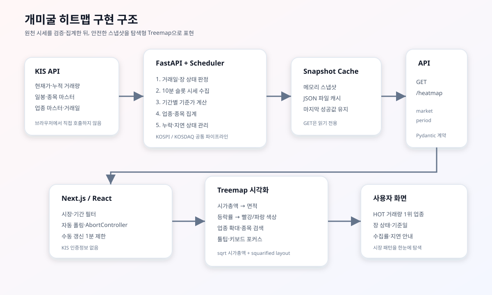

# 개미굴 히트맵 발표자료

> 발표용 5~7분 구성입니다. `/hitmap` 화면을 함께 띄우고 각 슬라이드의 핵심 문장을 설명하면 됩니다.



## 1. 문제 정의: 시장의 온도를 한눈에 보기

- 수많은 종목의 가격과 거래량을 표만으로 비교하기 어렵다.
- 업종별 자금 쏠림과 상승·하락 강도를 한 화면에서 파악할 필요가 있다.
- 그래서 **업종과 종목을 면적·색상·정렬로 동시에 표현하는 시장 히트맵**을 구현했다.

**발표 멘트**

> “개미굴 히트맵은 시장 전체를 숫자 목록이 아니라 공간적인 패턴으로 보여줍니다. 어떤 업종이 크고, 어떤 종목이 뜨겁고, 거래량이 어디에 모이는지 빠르게 읽을 수 있습니다.”

## 2. 서비스 한눈에 보기

### 사용자가 선택하는 축

- 시장: `KOSPI` / `KOSDAQ`
- 기간: `일일` / `주간` / `월간`
- 상태: 장 시작 전, 장중, 장 마감, 휴장일

### 화면에서 제공하는 정보

- 업종별 시가총액 기반 크기
- 종목별 등락률 기반 색상
- 거래량 1위 업종과 시장 내 비중
- 현재가, 시가총액, 거래량, 데이터 기준일
- 데이터 수집 진행률과 지연 여부

## 3. 백엔드 수집 파이프라인

1. KIS API에서 시장 캘린더를 확인한다.
2. KOSPI/KOSDAQ 종목 마스터와 업종 마스터를 하루 단위로 준비한다.
3. 장중에는 최대 30종목 단위로 현재가·누적 거래량을 순차 수집한다.
4. 주간·월간 화면은 최근 70일 일봉 이력으로 기준가격과 기간 거래량을 계산한다.
5. 종목을 업종별로 그룹화하고 업종의 시가총액·거래량·등락률을 집계한다.
6. `HeatmapResponse` 형태로 메모리와 파일 캐시에 발행한다.

### 데이터 정확성을 위한 처리

- 중복 종목 코드는 하나만 유지해 거래량 이중 집계를 방지한다.
- 신규 상장 등 기준가격이 없는 종목은 등락률만 `null`로 표시한다.
- 현재 거래일 누적 거래량과 일봉 거래량을 중복해서 더하지 않는다.
- 일부 종목 수집 실패 시 0으로 채우지 않고 누락 상태를 표시한다.
- 완전한 이전 스냅샷이 있으면 화면 순위가 흔들리지 않도록 이전 전체 스냅샷을 유지한다.

## 4. 갱신·캐시 전략

- 백엔드 스케줄러는 매분 수집 필요 여부를 검사한다.
- 실제 장중 수집은 10분 단위 슬롯으로 제한한다.
- 장 마감 30초 후 최종값을 저장한다.
- 장외에 서버를 시작하면 일봉으로 복원하고, 시간외 거래 포함 가능성을 안내한다.
- JSON 파일 캐시는 서버 재시작 후에도 마지막 성공 데이터를 복원한다.
- 브라우저의 GET 요청은 KIS를 직접 호출하지 않고 저장된 스냅샷만 읽는다.

**핵심 설계 효과**

> “수집 비용은 통제하면서도, 사용자는 항상 마지막으로 검증된 화면을 볼 수 있습니다.”

## 5. 프론트엔드 시각화

### Treemap 레이아웃

- 화면에는 시가총액 상위 8개 업종을 표시한다.
- 큰 업종 4개는 상위 종목 5개씩, 나머지 업종은 4개씩 표시한다.
- 면적은 `sqrt(시가총액)`을 가중치로 사용해 대형주가 화면을 독점하지 않게 했다.
- 직접 구현한 squarified treemap으로 빈 공간 없이 사각형을 배치한다.

### 색상 체계

- 상승: 빨강 계열
- 하락: 파랑 계열
- 보합: 중립 회색
- 등락률 미제공: 회색
- 등락률의 절대값이 클수록 색상 강도를 높인다.

## 6. 사용자 경험 기능

- 업종 선택 시 해당 업종만 확대한다.
- 뒤로 가기 버튼으로 전체 업종 화면에 복귀한다.
- 종목명·종목코드 검색으로 표시된 기업을 빠르게 찾는다.
- 마우스 오버·포커스·클릭으로 종목을 강조한다.
- 툴팁에 등락률, 현재가, 시가총액, 거래량을 제공한다.
- `ResizeObserver`로 컨테이너 크기에 맞춰 레이아웃을 다시 계산한다.
- 시장·기간을 바꾸면 이전 요청을 취소하고 새 데이터 생명주기를 시작한다.
- 자동 조회는 다음 갱신 시각에 맞춰 예약하고, 수집 중에는 15초 간격으로 진행 상태를 확인한다.
- 수동 UPDATE는 1분에 한 번으로 제한해 API 남용을 막는다.
- 30초 요청 타임아웃과 오류 메시지로 연결 지연을 안내한다.

## 7. API와 데이터 계약

```text
GET /heatmap?market=kospi&period=day
GET /heatmap?market=kosdaq&period=week
```

응답은 다음 정보를 포함한다.

```text
market, period
updated_at, as_of_date, next_update_at
market_status, is_stale, is_refreshing, message
coverage
top_sector
sectors[].stocks[]
```

프론트엔드는 `NEXT_PUBLIC_API_BASE_URL`만 사용하고, KIS 키는 백엔드에만 둔다. 이 구조로 인증정보를 브라우저에 노출하지 않으면서 API와 화면을 분리했다.

## 8. 구현 결과와 검증

- 백엔드: FastAPI + APScheduler + Pydantic 응답 모델
- 데이터: KIS 현재가·일봉·종목/업종 마스터·거래일 API
- 프론트엔드: Next.js + React + TypeScript
- 검증한 항목:
  - 백엔드 Python 문법 검사 통과
  - 프론트엔드 TypeScript 검사 통과
  - `GET /` 응답 200
  - `GET /heatmap` 응답 200
  - `http://localhost:3000/hitmap` 브라우저 렌더링 확인

## 9. 마무리 한 문장

> “개미굴 히트맵은 KIS 원천 데이터를 거래일·기간·업종 기준으로 안전하게 집계하고, 시가총액은 면적으로, 등락률은 색상으로, 거래량 1위는 별도 지표로 보여주는 탐색형 시장 대시보드입니다.”

## 발표 데모 순서

1. `/hitmap` 접속
2. KOSPI와 KOSDAQ 전환
3. 일일 → 주간 → 월간 전환
4. 업종 선택으로 확대
5. 종목명 검색 및 상세 툴팁 확인
6. 거래량 1위 업종, 기준일, 장 상태 설명
7. UPDATE 버튼의 1분 제한과 수집 상태 안내

